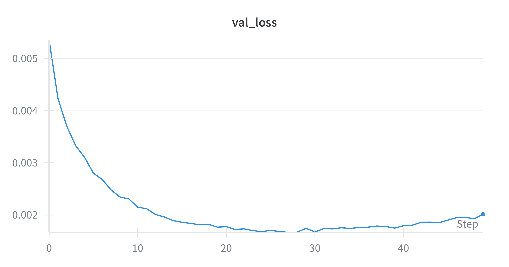
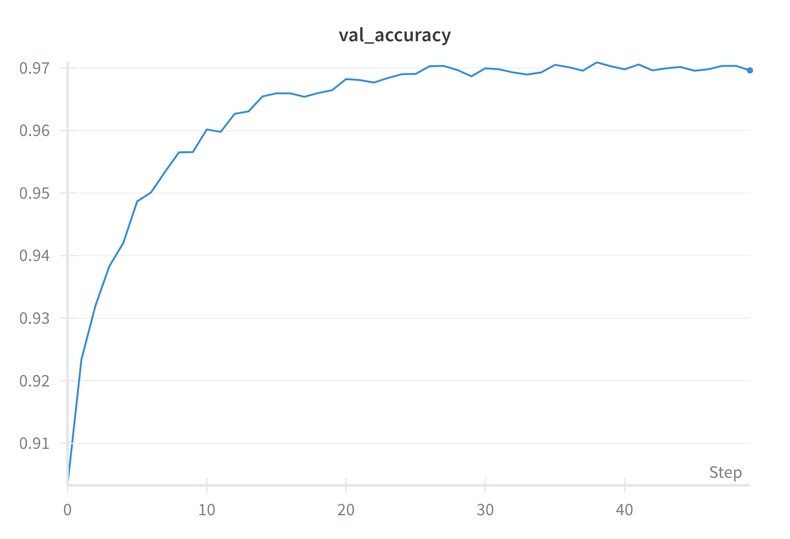
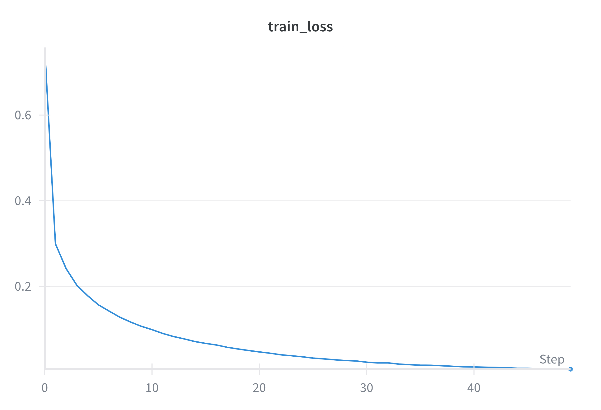
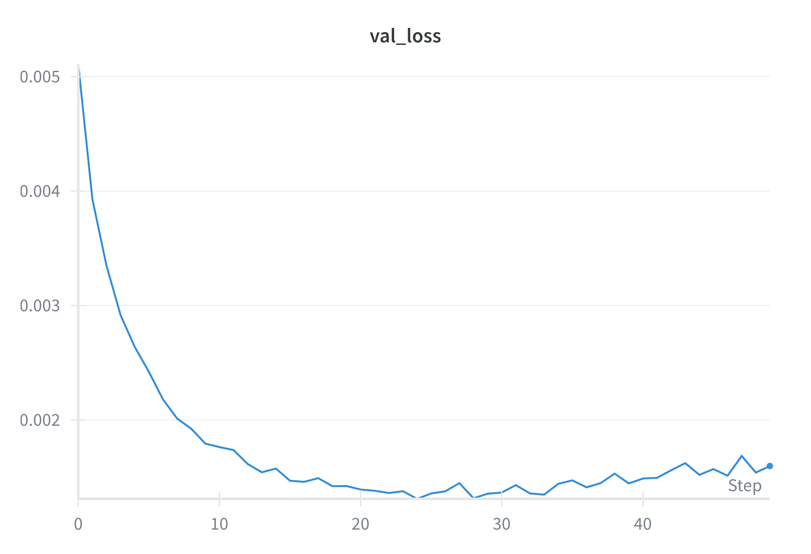
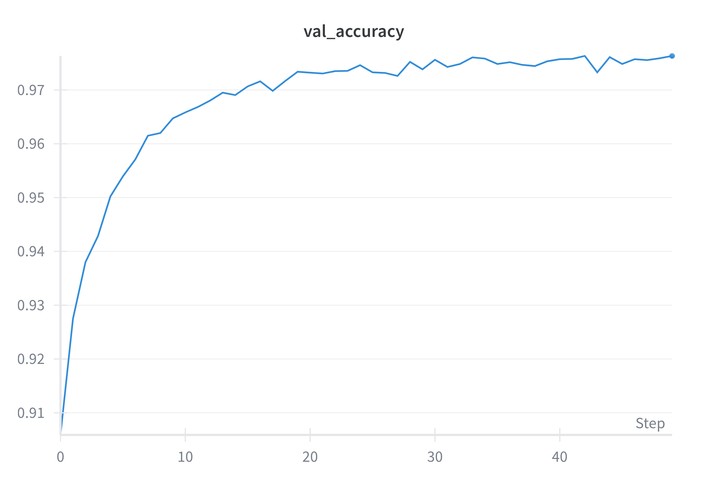
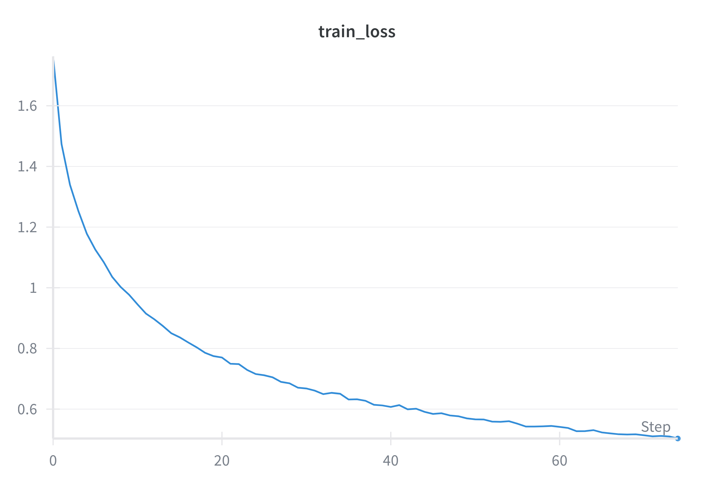
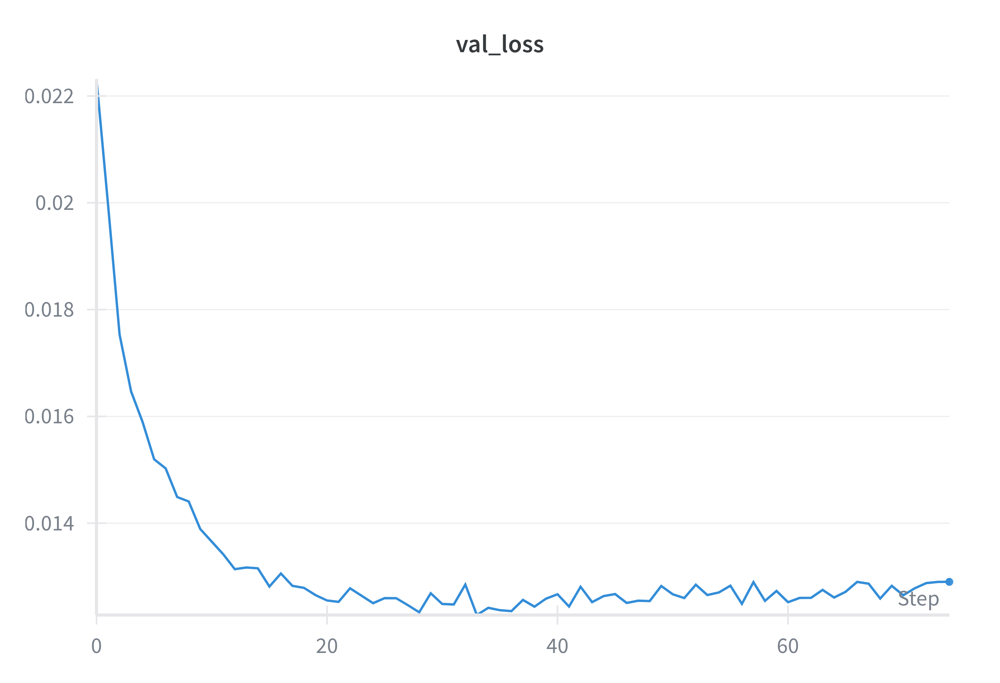
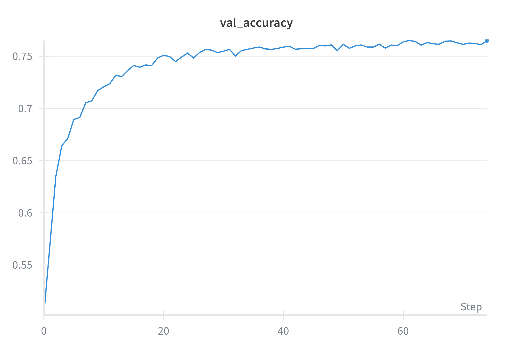

# DLA_LABS

## Contents

1. [Completed exercises](#completed-exercises)
2. [Detailed file structure](#file-structure)
3. [Environment](#environment)
4. [Exercise 1.1](#exercise-11---simple-mlp)
5. [Exercise 1.2](#exercise-12---mlp--residual-connections)
6. [Exercise 1.3](#exercise-13---cnn)
7. [Exercise 2.3](#exercise-23---explain-the-predictions-of-a-cnn)

## Completed exercises

|  Exercise   | DONE  | WIP |
|-----|---|---|
| LAB01 Exercise 1.1 | ✅ | |
| LAB01 Exercise 1.2 | ✅ | |
| LAB01 Exercise 1.3 | ✅ | |
| LAB01 Exercise 2.3 | ✅ | |

## File Structure

```linux
LAB01
│   README.md
│   environment.yml
│   exercise_1_1.py
│   exercise_1_2.py
│   exercise_1_3.py
│   exercise_2_3.py
│   models.py
│   dataset.py
│   evaluate.py
│   training.py
│   
└───assets
 
 ```

## Environment

The testing environment has been managed with anaconda:
`conda env create -f environment.yml`

## Exercise 1.1 - Simple MLP

This first exercise consists in an implementation of a simple multilayer perceptron to classify the 10 digits of the  **MNIST** dataset. So the goal is to solve a simple classification task. The main challenge I faced in designing the code to solve this task was to build an efficent training and evaluate function that would work consistently also for the next exercises.

### MNIST dataset

The informations about the dataset relevant for this exercise are:

- MNIST images are 28x28 pixels in gray-scale (1 channel)
- There are 10 classes

### Implementation 1.1

The hyperparameters are defined in the *Exercise1_1.py* file in a dictionary called *config*. I put here the most relevant ones:

- Learning rate: 0.0001
- Optimizer: Adam
- Batch size: 64
- Loss function: Cross-entropy
- Epochs: 50

In the tests for this exercise the model used contained 4 layers:

- The first layer size is 28*28 as this is the size of an image from the **MNIST** dataset
- Two 64 neuron layers
- The last layer size is 10 as **MNIST** has 10 classes

The training function has been defined in the *training.py* file and has been reused for the rest of the lab. The training function takes as parameters: the model, the training and validation sets and a dictionary containing all the hyperparameters called *config*.
The first thing it does is to create instances for the **optimizer** and the **loss** based on the *config*. Then it checks if it should train from scratch or keep going from a previous checkpoint (in that case the checkpoint gets loaded from memory). At this point the training loop begins and after each epoch the model gets evaluated on the validation set. The computed accuracy and loss get logged on both *tensorboard* and *wandb*. Finally it saves a checkpoint if the epoch requires it and at the end of the cycle it returns two arrays containing validation accuracies and validation losses.

As for the training function the evaluation function has been defined in its own file *evaluate.py* and has been reused thoughout this lab. The function computes an accuracy score comparing the ground truths against the predictions.

### Results 1.1

The training and validation losses reach a very low values in just 50 epochs as the **MNIST** dataset is quite simple.


We notice a similar trend in the validation accuracy that in just 50 epochs reaches a value of over *97%*

I finally tested the trained model on the test set and it achieved a very good result considering the short training and the simplicity of the model.
**Loss on test set:** 0.0016719
**Accuracy on test set:** 0.9733

## Exercise 1.2 - MLP + residual connections

In this exercise I implemented a Skip-MLP model and trained it on the CIFAR-10 dataset. The goal was to build a model with skip connections, which can help with vanishing gradients and improve training performance. This exercise proved to be challenging in managing skip connections between layers with different sizes but after dealing with that it performed marginally better compared to the simple MLP. I also tried testing it on the CIFAR10 dataset but after a few tests I figured that the model wasn't powerful enough as the test loss kept going down but the validation loss started increasing and the accuracy stopped at about 50%. To try and solve this I added a dropout layer to the skipblock but the improvement was negligible.

### Implementation

The hyperparameters are defined in the *Exercise1_2.py* file in a dictionary called *config*. I put here the most relevant ones:

- Learning rate: 0.0001
- Optimizer: Adam
- Batch size: 64
- Loss function: Cross-entropy
- Epochs: 50

Building on the previous exercises I only had to implement the new model structure for this to work. The skip-MLP I implemented builds the first and last layers as simple linear layers, every layer in between is created as a skip-block. The skip-blocks are defined as two linear layers with a ReLu layer in between linearity and with a connection that sums the input and the output of the layer. If the input and output size differ the input is passed though a bridge layer that changes the input size to make it match with the output.

### Results 1.2

The training and validation losses reach a very low values in just a few epochs but the training was run for 50 epochs. The skip-MLP performs just as expected, obtaining similar results to the regular MLP with a slight improvement.


In this case the maximum validation accuracy reached was just over *97.6%*

I finally tested the trained model on the test set and it achieved a more than acceptable result:
**Loss on test set:** 0.001513
**Accuracy on test set:** 0.9756

## Exercise 1.3 - CNN

In this exercise, I built and trained a Fully convolutional CNN (Convolutional Neural Network) on the CIFAR-10 dataset. The focus was on implementing a convolutional architecture to solve a standard image classification task and preparing for the following exercise in which this architecture will be reused. The challeges faced in this exercise had to do with correctly managing layer sizes while still keeping the model modular and adaptable.

### CIFAR-10 Dataset

The informations about the dataset relevant for this exercise are:

- CIFAR-10 images are 32x32 color images (3 channels)
- There are 10 classes

### Implementation 1.3

The hyperparameters are defined in the *Exercise1_3.py* file in a dictionary called *config*. I put here the most relevant ones:

- Learning rate: 0.001
- Optimizer: adam
- Batch size: 64
- Loss function: cross-entropy
- Epochs: 75

The CNN I implemented takes an array of layer sizes in input and optionally: the size of the image, the amout of channels, the kernel size, stride and padding that get used for each layer. A further implementation could be to have a model that gets a matrix of layers instead of an array so that it can deal with having layers with different kernel sizes paddings and strides.
Each layer is followed by a *batch normalization* layer, a *ReLu* activation function, a *Dropout layer* and a *Max Pooling* layer.

### Results

The training on the **CIFAR10** dataset proved very challenging when approached with an MLP with skip connections but with a bit of tuning a CNN solved it without too many sweats.


In this case the maximum validation accuracy reached was just over *76.5%* which isn't as high as what a state of the art CNNs can achieve but it's reasonable considering the rather simple network.

I finally tested the trained model on the test set and it achieved a result consistent with the validation performance:
**Accuracy on test set:** 0.761

## Exercise 2.3 - Explain the predictions of a CNN

### Imagenette dataset

### Implementation 2.3

### Results 2.3
