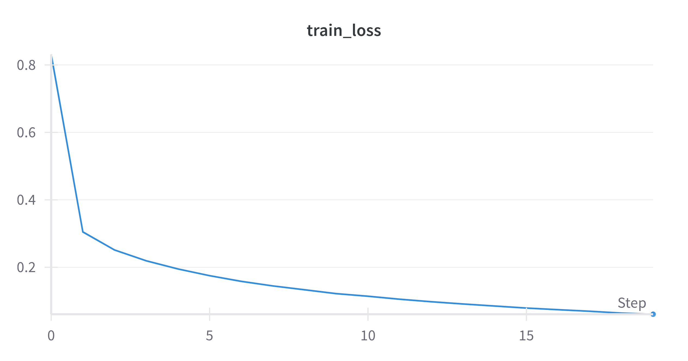
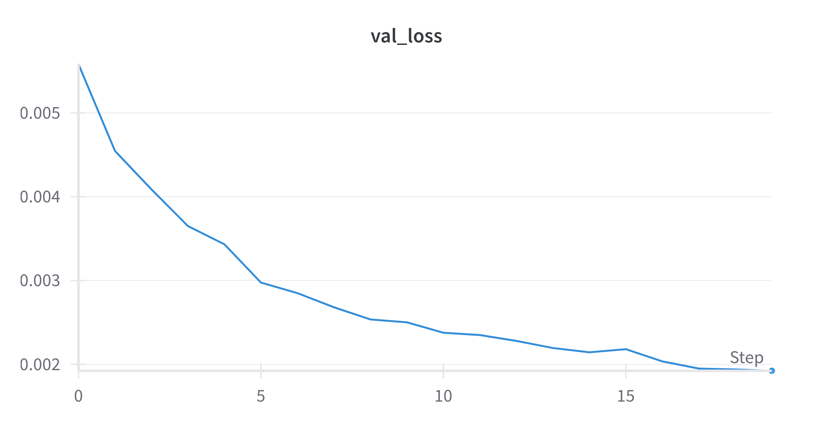
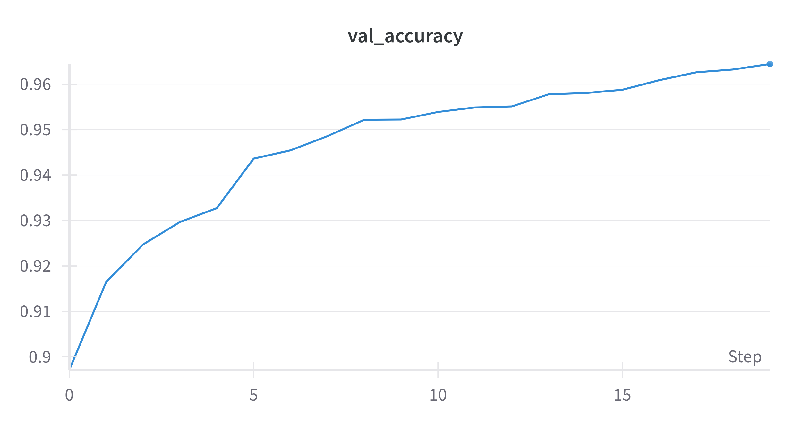

# DLA_LABS

## Contents

1. [Completed exercises](#completed-exercises)
2. [Detailed file structure](#file-structure)
3. [Environment](#environment)
4. [Exercise 1.1](#exercise-11---simple-mlp)
5. [Exercise 1.2](#exercise-12---mlp--residual-connections)
6. [Exercise 1.3](#exercise-13---cnn)
7. [Exercise 2.3](#exercise-23---explain-the-predictions-of-a-cnn)

## Completed exercises

|  Exercise   | DONE  | WIP |
|-----|---|---|
| LAB01 Exercise 1.1 | ✅ | |
| LAB01 Exercise 1.2 | ✅ | |
| LAB01 Exercise 1.3 | ✅ | |
| LAB01 Exercise 2.3 |  | 🔁 |

### TODO List

- LAB01 Save models
- LAB01 Comment everything
- LAB01 Visualize conv kernels
- LAB01 Analyze gradients
- LAB01 Exercise 2

## File Structure

```
LAB01
│   README.md
│   environment.yml
│   
└───logs
│   └─── checkpoints
│   └─── tensorboard
│
└───models
│        CNN.py
│   
└───utils   
│
│   exercise_1_1.py
│   exercise_1_2.py
│   exercise_1_3.py
│   exercise_2_3.py
│   data.py
│   evaluate.py
│   train.py

 ```

## Environment

The testing environment has been managed with anaconda:
`conda env create -f environment.yml`

## Exercise 1.1 - Simple MLP

Implementation of a simple multilayer perceptron to classify the 10 digits of the  **MNIST** dataset.

### Implementation

In the tests for this lab the model used contained 5 layers:

- The first layer size is 28*28 as this is the size of an image from the **MNIST** dataset
- The following layer sizes have been randomly selected
- The last layer size is 10 as **MNIST** has 10 classes

The training function has been defined in the *training.py* file and has been reused for the rest of the lab. The training function gets the model, the training and validation sets and a dictionary containing all the hyperparameters called *config*.
The first thing the function does is to create instances for the **optimizer** and the **loss** based on the *config*. Then it checks if it should train from scratch or keep going from a previous checkpoint (in that case the checkpoint gets loaded from memory). At this point the training loop begins and after each epoch the model gets evaluated on the validation set. The computed accuracy and loss get logged on both *tensorboard* and *wandb*. Finally it saves a checkpoint if the epoch requires it and at the end of the cycle it returns two arrays containing validation accuracies and validation losses.

As for the training function the evaluation function has been defined in its own file *evaluate.py* and has been reused thoughout this lab. The function computes an accuracy score comparing the ground truths against the predictions.

### Results




**Loss on test set:** 0.0017312777630984783
**Accuracy on test set:** 0.9674

## Exercise 1.2 - MLP + residual connections

Implementation of a multilayer perceptron with residual connections. The MLP constructor takes an array of int that represent the layers of the MLP.

### Implementation

### Results

## Exercise 1.3 - CNN

Implementation of a simple CNN

### Implementation

### Results

## Exercise 2.3 - Explain the predictions of a CNN

### Implementation

### Results
