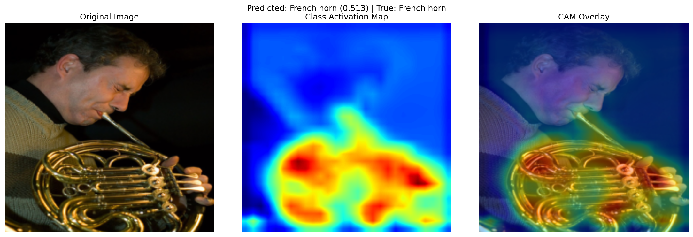
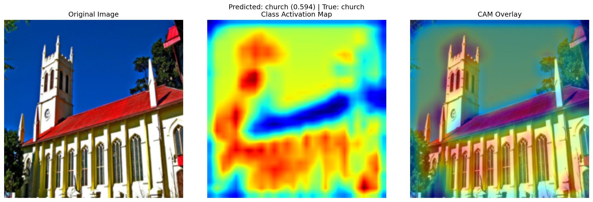
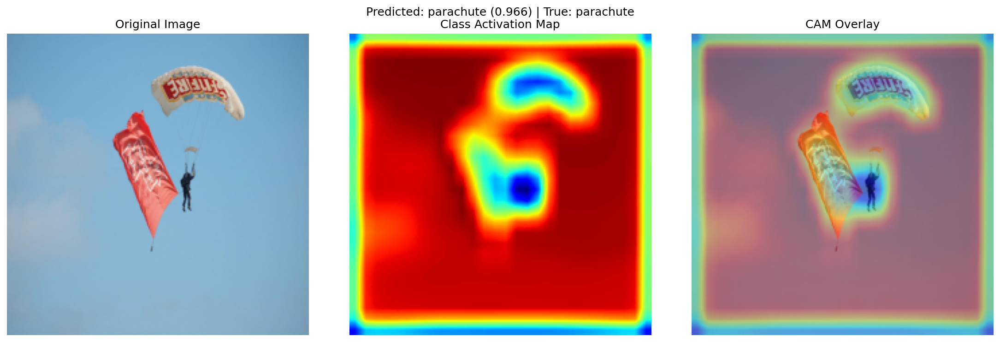
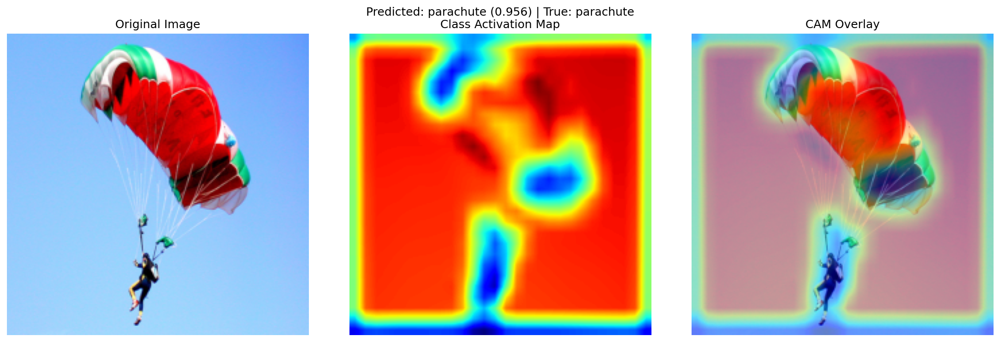
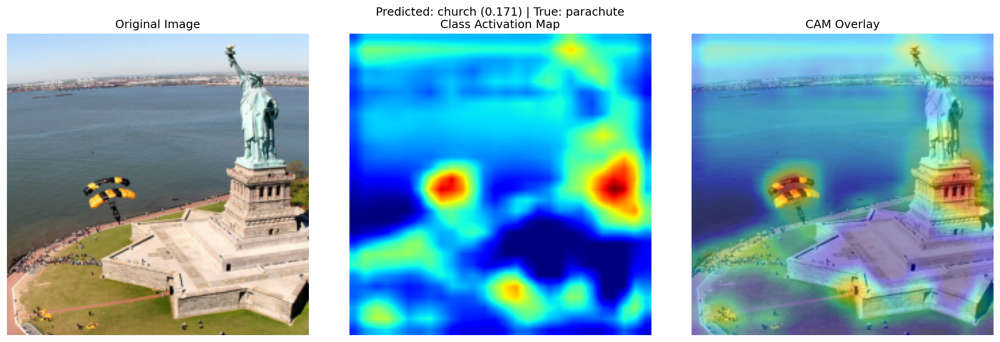
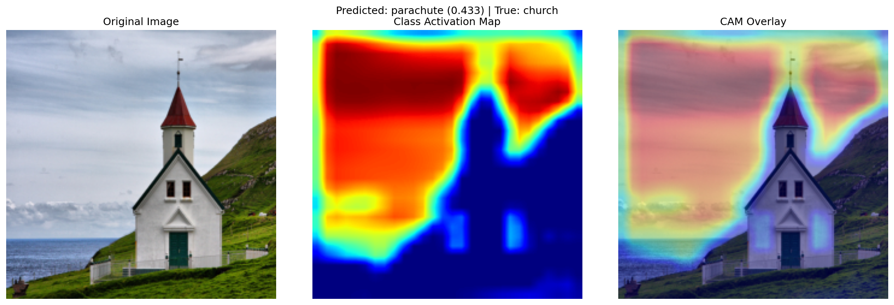

# LAB01

## Contents

1. [Completed exercises](#completed-exercises)
2. [Detailed file structure](#file-structure)
3. [Exercise 1.1](#exercise-11---simple-mlp)
4. [Exercise 1.2](#exercise-12---mlp--residual-connections)
5. [Exercise 1.3](#exercise-13---cnn)
6. [Exercise 2.3](#exercise-23---explain-the-predictions-of-a-cnn)

## Completed exercises

|  Exercise   | DONE  | WIP |
|-----|---|---|
| LAB01 Exercise 1.1 | ✅ | |
| LAB01 Exercise 1.2 | ✅ | |
| LAB01 Exercise 1.3 | ✅ | |
| LAB01 Exercise 2.3 | ✅ | |

## File Structure

```linux
LAB01
│   README.md
│   exercise_1_1.py
│   exercise_1_2.py
│   exercise_1_3.py
│   exercise_2_3.py
│   cam.py
│   models.py
│   dataset.py
│   evaluate.py
│   training.py
│   
└───assets
 
 ```

## Exercise 1.1 - Simple MLP

This first exercise consists in an implementation of a simple multilayer perceptron to classify the 10 digits of the  **MNIST** dataset. So the goal is to solve a simple classification task. The main challenge I faced in designing the code to solve this task was to build an efficient training and evaluation function that would work consistently also for the next exercises.

### MNIST dataset

The information about the dataset relevant for this exercise is as follows:

- MNIST images are 28x28 pixels in gray-scale (1 channel)
- There are 10 classes
- Each image represents a digit from 0 to 9

### Implementation 1.1

The hyperparameters are defined in the *Exercise1_1.py* file in a dictionary called *config*. I put here the most relevant ones:

- Learning rate: 0.0001
- Optimizer: Adam
- Batch size: 64
- Loss function: Cross-entropy
- Epochs: 50

In the tests for this exercise the model used contained 4 layers:

- The first layer size is 28*28 as this is the size of an image from the **MNIST** dataset
- Two 64 neuron layers
- The last layer size is 10 as **MNIST** has 10 classes

The training function has been defined in the *training.py* file and has been reused for the rest of the lab. The training function takes as parameters: the model, the training and validation sets and a dictionary containing all the hyperparameters called *config*.
The first thing it does is to create instances for the **optimizer** and the **loss** based on the *config*. Then it checks if it should train from scratch or keep going from a previous checkpoint (in that case the checkpoint gets loaded from memory). At this point the training loop begins and after each epoch the model gets evaluated on the validation set. The computed accuracy and loss get logged on both *tensorboard* and *wandb*. Finally it saves a checkpoint if the epoch requires it and at the end of the cycle it returns two arrays containing validation accuracies and validation losses.

As for the training function, the evaluation function has been defined in its own file *evaluate.py* and has been reused thoughout this lab. The function computes an accuracy score comparing the ground truths against the predictions.

### Results 1.1

The training and validation losses reach a very low value in just 50 epochs as the **MNIST** dataset is quite simple.


We notice a similar trend in the validation accuracy that in just 50 epochs reaches a value of over *97%*

I finally tested the trained model on the test set and it achieved a very good result considering the short training and the simplicity of the model.
**Loss on test set:** 0.0016719
**Accuracy on test set:** 0.9733

## Exercise 1.2 - MLP + residual connections

In this exercise I implemented a Skip-MLP model and trained it on the MNIST dataset. The goal was to build a model with skip connections, which can help with vanishing gradients and improve training performance. This exercise proved to be challenging in managing skip connections between layers with different sizes but after dealing with that it performed marginally better compared to the simple MLP. I also tried testing it on the CIFAR10 dataset but after a few tests I figured that the model wasn't powerful enough as the test loss kept going down but the validation loss started increasing and the accuracy stopped at about 50%. To try and solve this I added a dropout layer to the skipblock but the improvement was negligible.

### Implementation

The hyperparameters are defined in the *Exercise1_2.py* file in a dictionary called *config*. I put here the most relevant ones:

- Learning rate: 0.0001
- Optimizer: Adam
- Batch size: 64
- Loss function: Cross-entropy
- Epochs: 50

Building on the previous exercise I only had to implement the new model structure for this to work. The skip-MLP I implemented builds the first and last layers as simple linear layers, every layer in between is created as a skip-block. The skip-blocks are defined as two linear layers with a ReLu layer in between and with a connection that sums the input and the output of the layer. If the input and output size differ, the input is passed through a bridge layer that changes the input size to make it match with the output.

### Results 1.2

The training and validation losses reach a very low value in just a few epochs but the training was run for 50 epochs. The skip-MLP performs just as expected, obtaining similar results to the regular MLP with a slight improvement.


In this case the maximum validation accuracy reached was just over *97.6%*

I finally tested the trained model on the test set and it achieved a more than acceptable result:
**Loss on test set:** 0.001513
**Accuracy on test set:** 0.9756

## Exercise 1.3 - CNN

In this exercise, I built and trained a Fully convolutional CNN (Convolutional Neural Network) on the CIFAR-10 dataset. The focus was on implementing a convolutional architecture to solve a standard image classification task and preparing for the following exercise in which this architecture will be reused. The challeges faced in this exercise had to do with correctly managing layer sizes while still keeping the model modular and adaptable.

### CIFAR-10 Dataset

The information about the dataset relevant for this exercise is:

- CIFAR-10 images are 32x32 color images (3 channels)
- There are 10 classes

### Implementation 1.3

The hyperparameters are defined in the *Exercise1_3.py* file in a dictionary called *config*. I put here the most relevant ones:

- Learning rate: 0.001
- Optimizer: adam
- Batch size: 64
- Loss function: cross-entropy
- Epochs: 75

The CNN I implemented takes an array of layer sizes in input and optionally: the size of the image, the amout of channels, the kernel size, stride and padding that get used for each layer. A further implementation could be to have a model that takes a matrix of layers instead of an array so that it can deal with having layers with different kernel sizes, paddings and strides.
Each layer is followed by a *batch normalization* layer, a *ReLu* activation function, a *Dropout layer* and a *Max Pooling* layer.

### Results

The training on the **CIFAR10** dataset proved very challenging when approached with an MLP with skip connections but with a bit of tuning a CNN solved it without too many sweats.


In this case the maximum validation accuracy reached was just over *76.5%* which isn't as high as what a state of the art CNN can achieve but it's reasonable considering the rather simple network.

I finally tested the trained model on the test set and it achieved a result consistent with the validation performance:
**Accuracy on test set:** 0.761

## Exercise 2.3 - Explain the predictions of a CNN

In this exercise, I implemented the Class Activation Mapping (CAM) algorithm to explain the predictions made by the CNN from the previous exercise but this time trained on the *Imagenette* dataset. The goal was to visualize the regions of input images that most strongly influenced the model's classification decisions. This involved modifying the CNN architecture to retain spatial information in the final convolutional layers and computing class-specific activation maps using the learned weights. The main challenges in this exercise included correctly handling feature maps.

### Implementation 2.3

In this exercise I created a pipeline to generate Class Activation Maps for my CNN. The core function, *generate_class_activation_map* takes a trained model and an input image and extracts the output of the last convolutional layer. Then it computes a class-specific activation map. The CAM highlights the regions in the image that most influenced the model's prediction, helping to interpret how the CNN "sees" different classes.The confidence score for the predicted class is also computed to give context to the visual explanation.

To make the results easy to interpret I also implemented a visualization function called *save_cam_visualization* which creates a side-by-side comparison of the original image, the standalone CAM, and an overlay of the two. The cam function ties everything together by sampling a few images from each class in the test dataset, running CAM generation on them, and saving the resulting visualizations in a structured folder. This setup allows for quick analysis of how the model behaves across all classes and can be reused or extended for further model interpretability experiments.

### Results 2.3

The results I obtained from this experiment are interesting and support what I learned from the literature.
In some cases the CNN focuses very well on the correct parts of the image to determin the class, following a vision pattern similar to how humans see.
This example shows clearly that the correct prediction of *french horn* class was made based on the observation of what the man is holding and especially the more unique parts of it.

In this other example this *church* was correctly classified by looking at its windows and its bell tower but interestingly it ignored the roof.


In some other cases though the CNN *cheats* and the following example is a great example of it. The model correctly classifies this image as *parachute* and says so with an incredibly high confidence but this is only the result of looking at the sky and ignoring the parachute.

Here is another example of the same fenomenon:

When the model doesn't learn to recognize the actual *class object* but recognizes the enviroment is easier to trick. The proof is in the following image, The correct class is *parachute* but because the image isn't filled with a blue sky as the previous samples it gets missclassified as a *church*.

And also the opposite can happen, in this case this church has a background with a lot of sky so the model ignores the actual subject and confidently categorizes it as a parachute.

This experiment gave me a great insight on how my model learned and what its limitations can actually be.
