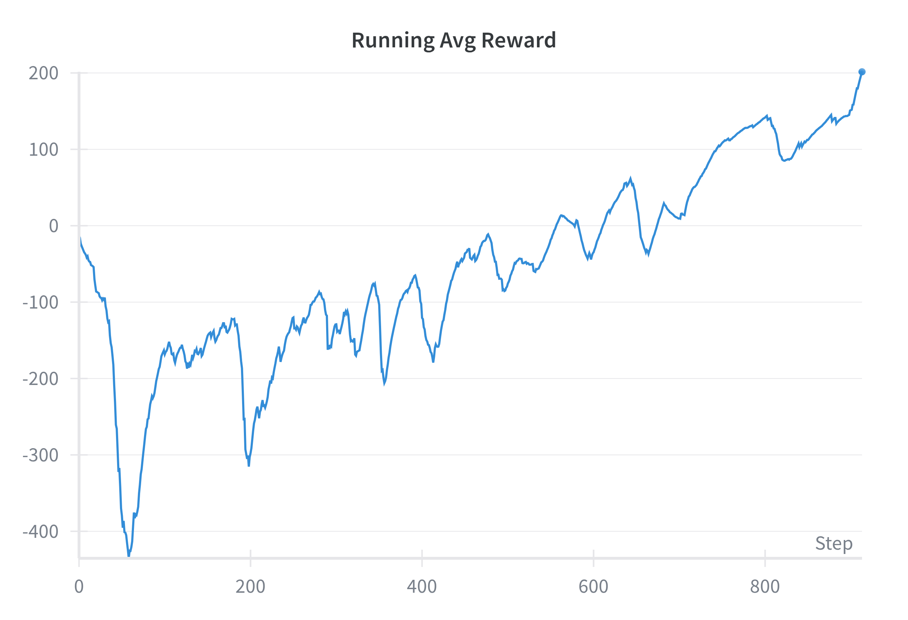
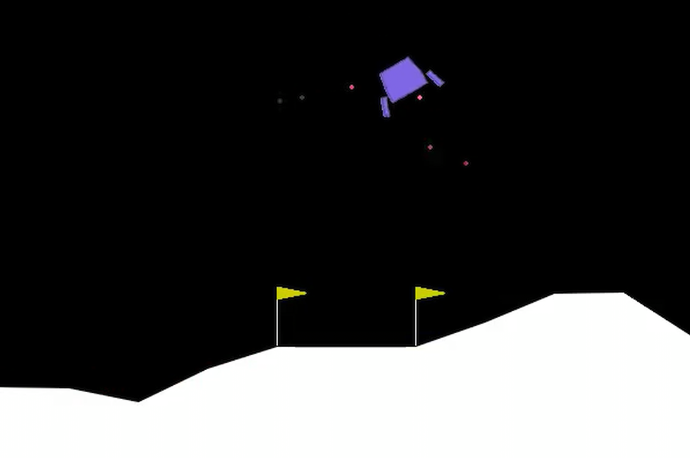

# LAB02

## Contents

1. [Completed exercises](#completed-exercises)
2. [Detailed file structure](#file-structure)
3. [Exercise 1](#exercise-1---reinforce-on-cartpole)
4. [Exercise 2](#exercise-2---reinforce--baseline-on-cartpole)
5. [Exercise 3](#exercise-31---reinforce-on-lunar-lander)

## Completed exercises

|  Exercise   | DONE  | WIP |
|-----|---|---|
| LAB01 Exercise 1 | ✅ |  |
| LAB01 Exercise 2 | ✅ |  |
| LAB01 Exercise 3.1 | ✅ |  |

## File Structure

```linux
LAB02
│   README.md
│   exercise_1.py
│   exercise_2.py
│   exercise_3.py
│   data.py
│   evaluate.py
│   models.py
│   reinforce.py
 ```

## Exercise 1 - Reinforce on cartpole

In this exercise I focused on improving the baseline implementation of the REINFORCE policy gradient algorithm and applying it to the Gymnasium CartPole-v1 environment.
The reinforce function used for this exercise was further expanded in the following exercises so it has been written in a modular way to ensure compatibility with all exercises. The environment has been considered solved when the running average passed the 195 points treshold.

### Gymnasium CartPole-v1 environment

The CartPole-v1 environment is a relatively simple control task. The agent has only two possible actions:

- 0: move the cart to the left
- 1: move the cart to the right

The objective is to balance a pole hinged on a moving cart by applying forces to the cart. The episode ends when the pole falls past a certain angle or the cart moves too far from the center.

### Implementation 1

The main effort in this first exercise was to build a strong foundation for the following exercises and that's exactly what I did.
I focused on building the *reinforce* function to train policy networks using policy gradients in the Gymnasium environments. The function is designed to be flexible and extensible. I also added functionality to resume training from saved checkpoints, making long-running experiments easier to manage.
To improve tracking and analysis, I integrated logging via Weights & Biases and TensorBoard. Additionally, I added an option to record videos of the agent’s behavior at regular intervals.

The policy network was implemented as a simple MLP with one hidden layer of 128 neurons and a softmax output layer to produce action probabilities.

### Results 1

By clicking on the following image you can see how the agent performs at the end of training
[](https://youtu.be/sLSyoD4sFgE)

The agent was able to solve the environment in 1084 episodes.


## Exercise 2 - Reinforce + baseline on cartpole

In this second exercise I polished the implementation of the *reinforce* function adding the possibility to use a value_function as a baseline.

### Implementation 2

Building on the *reinforce* implementation from the previous exercise, I extended the algorithm by adding support for using a value function as a baseline. This helps reduce the variance of the policy gradient estimates and improves training stability. In my implementation, the value function is an additional neural network that shares the same architecture and layer structure as the policy network. When enabled, the value network is trained using mean squared error loss to predict the discounted returns, and its outputs are used to compute the advantage, which replaces the raw returns in the policy update step.

### Results 2

The improvement over the previous exercise is clear, as the environment was solved more than 200 episodes faster using the baseline-enhanced implementation. Specifically, it took exactly 851 episodes to reach the same performance level in the same environment, demonstrating that the addition of a value function as a baseline behaved as expected. This confirms that incorporating a baseline effectively reduces the variance of the gradient estimates, allowing the policy to converge more efficiently.


## Exercise 3.1 - Reinforce on Lunar Lander

I was able to solve the lunar lander environment with the reinforce algorithm developed in the previous exercise just by fine tuning the parameters and changing the optimizer from *adam* to *adamW*
During training I noticed that the big difference in points assigned to different actions influences the speed at which some actions are learnt. The agent learns to avoid crashing at all costs quite fast as that gives a -100 reward but it takes a long time to learn to turn off the engines once it landed as keeping them on only gives a -0.3 or -0.03 per frame.

### Gymnasium LunarLander-v3 environment

The lunar lander environment is much more complex compared to CartPole. First of all there are 4 possible actions that the agent can perform compared to just two:

- 0: do nothing
- 1: fire left orientation engine
- 2: fire main engine
- 3: fire right orientation engine

It also introduces options for more variability in the enviroment like wind and gravity.

### Implementation 3.1

The implementation is the same used for the previous exercise but the main file can be found at `Exercise3.py`. The only slight modification I made was using a slightly deeper network for both the policy and value functions. I chose this adjustment because I was concerned that the simplicity of the previous model might not be sufficient to capture the complexity of the environment and learn an effective policy. By increasing the depth of the network, I aimed to give the model more capacity to approximate both the policy and value functions more accurately, which likely contributed to the improved learning performance.

### Results 3.1

I considered the environment solved once the running average reached 200 points, as the documentation explicitly states that this is the threshold for considering the task successfully completed. It can also be seen in the video that at that point the agent learnt to land the Lander without crashing it and turns off most thrusters.
The agent was able to get to that state after just 914 episodes.

By clicking on the following image you can see how the agent performs at the end of training
[](https://youtu.be/5qeNzieyuRM)

In LunarLander-v3 the wind option was also added so I tested how my implementation worked when the environment got even more complex. Fine-tuning the learning rate (making it smaller so the agent could learn faster) was enough for it to handle the environment even when wind was enabled. The change in learning rate shortened the training to just 422 episodes!


By clicking on the following image you can see how the agent performs at the end of training
[](https://youtu.be/61jpp1mGXF4)
